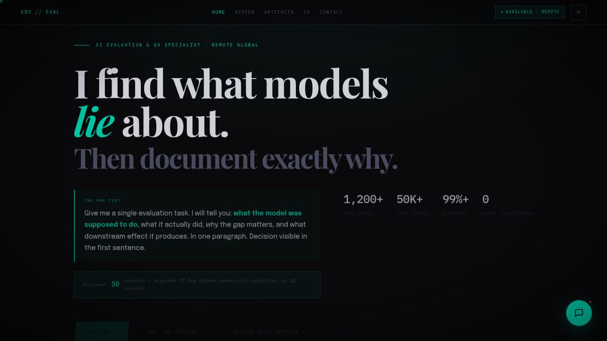

# Ebube Okeke — AI Evaluation & QA Portfolio

A professional portfolio and interactive demonstration of AI Evaluation methodologies, built for speed, performance, and analytical depth.



## 🌐 Overview

This repository contains the source code for my professional portfolio. It is designed not just as a static CV, but as a live demonstration of AI evaluation principles. 

The centerpiece of this site is a custom-built, multi-model chat interface that allows users to query an assistant and see **side-by-side responses from three different AI models simultaneously** (Gemini 2.0 Flash, Llama 3.1 8B, and Mistral Nemo). This mirrors the actual environment of an AI Evaluation Specialist comparing model outputs.

## ✨ Key Features

- **Multi-Model AI Chatbot**: Built with OpenRouter to query 3 models in parallel for side-by-side evaluation, with a responsive grid layout.
- **8-Step Evaluation System (`system.html`)**: A dedicated section detailing a proprietary, reproducible methodology for AI output QA, hallucination detection, and adversarial testing.
- **Artifacts Gallery (`artifacts.html`)**: Documented case studies of real-world AI evaluation challenges (e.g., Schema Drift, Africa Knowledge Gap, Visual Grounding Failures).
- **Standalone Print-Ready CV (`cv.html`)**: A clean, printable HTML version of my curriculum vitae that scales perfectly for PDF export.
- **Dark/Light Mode**: Full theme support synchronized across all pages via `localStorage`.
- **Performance Optimized**: Built with Vanilla JS and CSS for maximum speed. Monitored via Vercel Speed Insights.

## 🛠️ Tech Stack

- **Frontend**: Vanilla HTML5, CSS3 (Custom Variables, CSS Grid/Flexbox), Vanilla ES6 JavaScript.
- **Backend (Serverless)**: Node.js, Vercel Serverless Functions (`api/chat.js`).
- **AI Integration**: OpenRouter API (using native `fetch` for parallel execution).
- **Build Tool**: Vite (used for local development server and optimized production builds).
- **Analytics**: Vercel Web Analytics & Speed Insights.

## 📂 File Structure

```text
├── api/
│   └── chat.js             # Vercel Serverless Function (OpenRouter API logic)
├── public/
│   ├── main.js             # Frontend logic (chat widget, theme toggle, UI interactions)
│   ├── shared.css          # Global styling and design system
│   └── ...                 # Assets (images, favicon, JSON data)
├── index.html              # Homepage & Multi-model Chat Interface
├── system.html             # The 8-Step Evaluation Loop Documentation
├── artifacts.html          # Case Studies & Annotation Samples
├── cv.html                 # Standalone Resume Page
├── vercel.json             # Vercel deployment configuration
├── vite.config.ts          # Vite build configuration & Dev Server mock
└── package.json            # Minimal dependencies (Vite & Types)
```

## 💻 Local Development Setup

To run this project locally, you will need [Node.js](https://nodejs.org/) installed.

1. **Clone the repository:**
   ```bash
   git clone https://github.com/ebubeco/ai-evaluation-portfolio.git
   cd ai-evaluation-portfolio
   ```

2. **Install dependencies:**
   *(Only `vite` and `@types/node` are required for the build process)*
   ```bash
   npm install
   ```

3. **Set up environment variables:**
   Create a `.env` file in the root directory and add your OpenRouter API key. This is required for the backend function to work.
   ```env
   OPENROUTER_API_KEY=your_openrouter_api_key_here
   ```

4. **Start the development server:**
   ```bash
   npm run dev
   ```
   *Note: The Vite dev server (`vite.config.ts`) includes a mock handler for `/api/chat` so you can test the UI without consuming API credits locally if you prefer, or you can test against the real endpoint once deployed.*

## 🚀 Deployment (Vercel)

This project is optimized for deployment on Vercel.

1. Push your code to a GitHub repository.
2. Go to [Vercel](https://vercel.com) and import the repository.
3. Vercel will automatically detect the **Vite** framework.
4. **Important**: Before clicking Deploy, go to **Environment Variables** and add:
   - Key: `OPENROUTER_API_KEY`
   - Value: `sk-or-v1-...`
5. Click **Deploy**. Vercel will build the static assets into `dist/public` and deploy the `api/chat.js` file as a serverless function automatically based on `vercel.json`.

## 📜 License & Copyright

© 2026 Ebubechukwu Okeke. All rights reserved. 
Designed and built for professional portfolio demonstration purposes.
